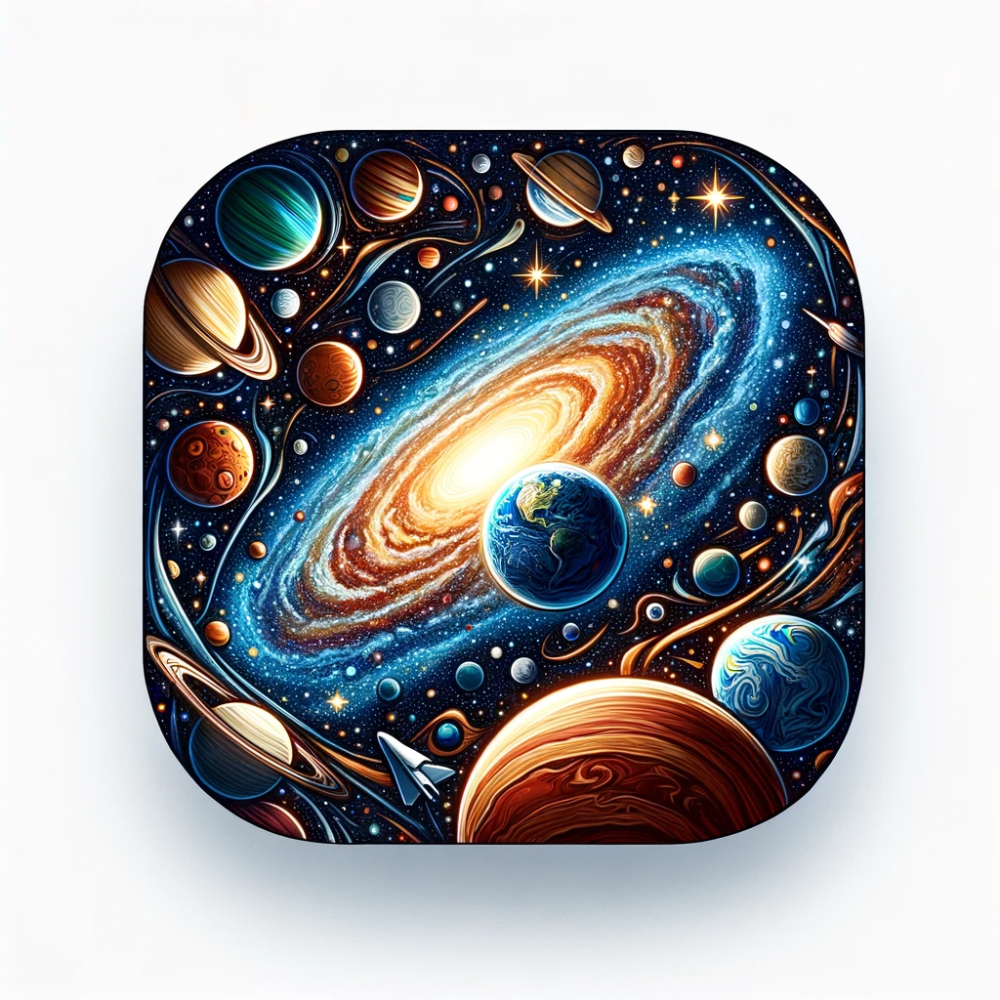

# NASA Gallery App – APOD Feature



[](https://github.com/igdutra/NASA-Gallery/actions/workflows/CI-macOS.yml)

## BDD Specs

### Story: Daily Access to NASA's Picture of the Day

### Narrative #1: Seamless Access to Latest Images

> "As a user interested in space,  
I want the app to automatically load the latest NASA Picture of the Day,  
So I can easily view the newest images of the universe."

#### Scenarios

```
Given the user has internet connectivity,
When they request to view the APOD images,
Then the app should display the latest images from NASA's remote API,
  And update the cache with this new content.
```

### Narrative #2: Viewing Images Offline

> "As a user without internet access,  
I want the app to show the most recently saved images,  
So I can enjoy images of the universe even when I'm offline."

#### Scenarios

```
Given the user lacks internet connectivity,
And there is a cache of images available,
When they request to view APOD images,
Then the app should display the most recent images from the cache.

Given the user is offline,
And the cache is empty,
When they request to view APOD images,
Then the app should display an error message.
```


## Use Cases

### Load APOD Items Use Case

#### Data:
- APOD API URL

#### Primary course (happy path):
1. Execute "Load APOD Items" command with the specified API URL.
2. System retrieves data from the provided APOD API URL.
3. System validates downloaded data.
4. System creates APOD items from valid data.
5. System delivers the processed APOD items for user access.

#### Invalid data – error course (sad path):
1. System delivers error.

#### No connectivity – error course (sad path):
1. System delivers error.

### Load APOD Items Fallback (Cache) Use Case

#### Data:
- Maximum acceptable age of cached data

#### Primary course:
1. Execute "Retrieve Cached APOD Items" command with the maximum cache age parameter.
2. System fetches APOD Items data from cache.
3. System validates cache age against the specified age criteria.
4. System creates APOD items from valid cached data.
5. System delivers APOD items.

#### Expired cache course (sad path): 
1. System delivers no APOD items.

#### Empty cache course (sad path): 
1. System delivers no APOD items.


### Save Feed Items Use Case

#### Data:
- APOD items

#### Primary course (happy path):
1. Execute "Save APOD Items" command with the given APOD items.
2. System encodes APOD items for caching.
3. System timestamps the new cache.
4. System replaces the cache with new data.
5. System delivers success message.

## Architecture


## Model Specs

### APOD Item

| Property        | Type                | Optional |
|-----------------|---------------------|----------|
| `date`          | `String`            | No       |
| `explanation`   | `String`            | No       |
| `mediaType`     | `String`            | No       |
| `title`         | `String`            | No       |
| `url`           | `URL`               | No       |
| `copyright`     | `String`            | Yes      |
| `hdurl`         | `URL`               | Yes      |
| `thumbnailUrl`  | `URL`               | Yes      |

### Payload contract

```
GET *url* (TBD)

200 RESPONSE

[
    {
        "copyright": "\nTengyu Cai\n",
        "date": "2023-10-25",
        "explanation": "Then suddenly, the Sun appears to shrink to nothing -- only to return tomorrow.",
        "media_type": "video",
        "service_version": "v1",
        "thumbnail_url": "https://img.youtube.com/vi/J3_88eyN44w/0.jpg", 
        "title": "Gone in 60 Seconds: A Green Flash Sunset",
        "url": "https://www.youtube.com/embed/J3_88eyN44w?rel=0"
    },
    {
        "date": "2011-09-28",
        "explanation": "Instant Gallery: See recent pictures of sunspot group AR 1302.",
        "hdurl": "https://apod.nasa.gov/apod/image/1109/ar1302flare_brahic_1304.jpg",
        "media_type": "image",
        "service_version": "v1",
        "title": "Violent Sunspot Group AR 1302 Unleashes a Flare",
        "url": "https://apod.nasa.gov/apod/image/1109/ar1302flare_brahic_900.jpg"
    },
    {
        "date": "2002-06-26",
        "explanation": "The above false-color digitally enhanced image was taken with the Gemini North telescope earlier this month.",
        "hdurl": "https://apod.nasa.gov/apod/image/0206/trifid_gemini_big.jpg",
        "media_type": "image",
        "service_version": "v1",
        "title": "In the Center of the Trifid Nebula",
        "url": "https://apod.nasa.gov/apod/image/0206/trifid_gemini.jpg"
    }
]
```
